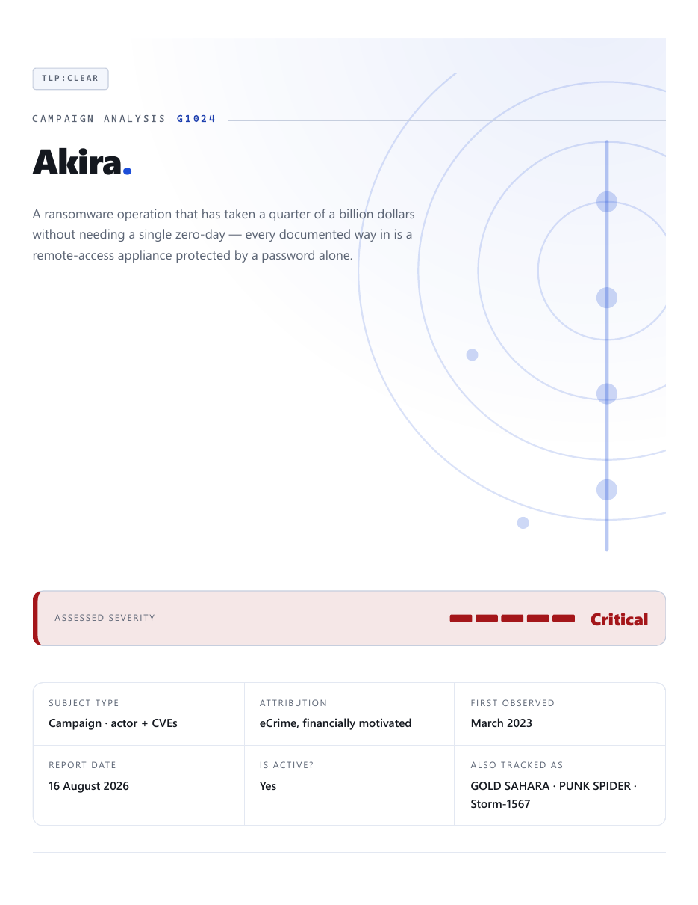
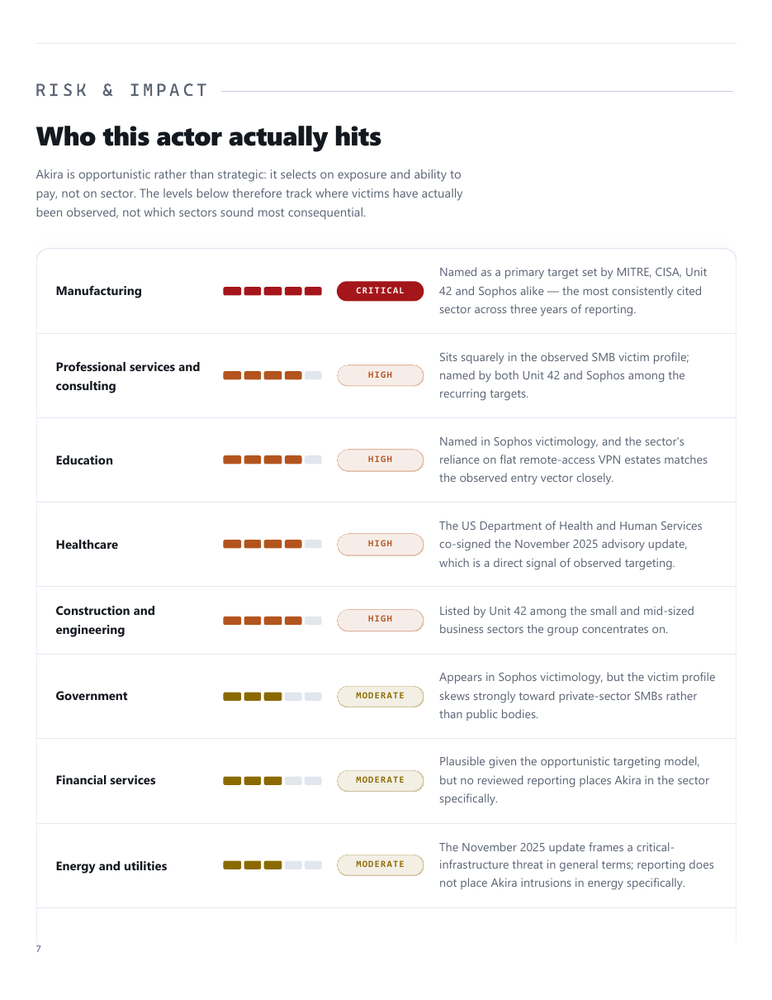
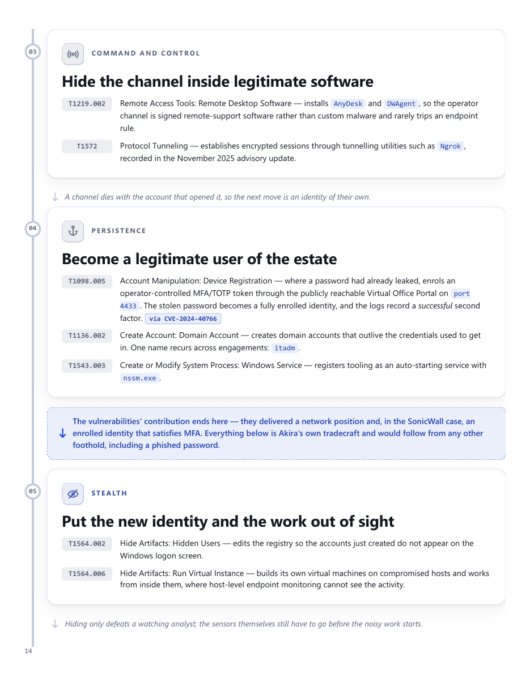

# TI-Provenance

**A pipeline that writes threat bulletins — and refuses to write one when the evidence isn't there.**

Ask any model for a threat report and you'll get one. That's the problem. What comes back reads
with total confidence whether it's built on four vendor reports or on nothing, and you can't tell
which sentences are load-bearing, which are inference, and which the model made up.

This project takes the opposite approach. Research comes from a fixed list of about fifty sources
and nowhere else. Every claim that isn't common knowledge carries a citation marker. The checks
don't warn you — they fail, and a bulletin that doesn't pass can't become a PDF.

The name is the point: you should be able to trace any sentence in the finished document back to
where it came from.

<p align="center">
  
</p>

## What you get

One document, two halves, and they're deliberately kept apart:

| | |
|---|---|
| **Part 1 — Analysis** | Who or what this is, what it has done in order, and **who is at risk and why** |
| **Part 2 — Attack flow** | **How** a compromise actually unfolds, tactic by tactic, mapped to MITRE ATT&CK |

Part 1 never lists attack techniques and Part 2 never re-argues risk. Say the same thing in two
places and the two will disagree within a month.

The risk table is where most reports quietly give up and paint everything red. This one has to
justify every level, and it has to include the sectors that *aren't* at risk — because a table
where every row says Critical tells you nothing at all.

<p align="center">
  
</p>

Part 2 turns the mapping into something you can read top to bottom. Each phase says what the
attacker achieved, which techniques did it, and why that phase made the next one possible. The
handoff line marks where the CVEs stop contributing and the actor's own tradecraft takes over —
which is usually the honest answer to "will patching fix this?"

<p align="center">
  
</p>

## Six worked examples

All six are in [`output/`](output/) as finished PDFs. They cover every subject type and every way
CVEs can relate to each other:

| Bulletin | Type | What it's an example of |
|---|---|---|
| [Akira](output/akira-threat-bulletin.pdf) | campaign | A ransomware crew whose every documented way in is a patchable edge appliance |
| [Agrius](output/agrius-threat-bulletin.pdf) | campaign | An Iranian crew running wipers dressed up as ransomware |
| [Andariel](output/andariel-threat-bulletin.pdf) | actor | North Korean espionage that pays for itself with ransomware |
| [Log4j](output/log4j-threat-bulletin.pdf) | remediation cascade | Four CVEs, three of them revealed by the fix for the one before |
| [ProxyShell](output/proxyshell-threat-bulletin.pdf) | exploit chain | Three Exchange flaws that only matter in sequence |
| [Windows Aug 2026](output/windows-2026-08-threat-bulletin.pdf) | independent set | Three unrelated flaws where the *lowest*-scoring one is the only one being exploited |

That last one shows why this is worth doing. Sorted by CVSS you'd patch the 9.8 first. Sorted by
what's actually being exploited you'd patch the 7.0 first, because someone is using it today and it
carries a deadline. The report argues for the second order and shows its working.

## How it works

Three worker skills, each self-contained. None of them knows the others exist — they meet through
a JSON contract, so you can run any one on its own:

```
analysis  ──→  analysis.json  ─┐
                               ├──→  merge  ──→  verify  ──→  PDF
mapping   ──→  mapping.json   ─┘
                    └──→  attack-flow report
```

**Analysis** researches the subject and writes the prose half. **Mapping** works out which ATT&CK
tactics and techniques the subject actually used. **Visualizer** renders a finished mapping as the
flow — and flatly refuses to do the mapping itself, because inventing technique IDs to fill a
diagram produces something that's wrong but looks authoritative.

A fourth skill, **threat-report**, drives all three. Give it a name or a link:

```
/threat-report Akira
/threat-report CVE-2021-44228
/threat-report https://www.cisa.gov/.../aa24-109a
```

A link is treated as a pointer to the subject, never as a source. It tells the pipeline *what* to
analyse; the research still comes only from the allowlist. Hand it a link to a blog nobody vetted
and you get a bulletin about that subject citing approved sources, or a refusal — not a bulletin
built on the blog.

## What stops it making things up

This is the part worth pointing at. Most of the engineering is in the refusals:

- **A source allowlist.** About fifty sources, each tagged by tier. Attribution has to rest on a
  primary — a news site reporting a vendor's finding is a pointer to that vendor, not a substitute
  for it. If a claim can't be traced, it doesn't go in.
- **Provenance survives the handoff.** Citations aren't prose, they're integer indices into a
  source list, and the validator rejects one that doesn't resolve.
- **Failing checks fail the run.** Verifiers exit non-zero and the exporter runs them itself, so a
  bulletin with a surviving placeholder — or with no remediation guidance at all — cannot become a
  PDF.
- **Nothing checked is not the same as nothing wrong.** Every verifier refuses an empty file set
  rather than reporting "clean, 0 files checked".
- **Every risk level needs a reason.** A level with no justification is a guess with a colour on
  it, so the validator rejects it.
- **The reader never sees the plumbing.** No skill name, internal path or template jargon may
  appear in text a reader sees. Three separate gates enforce that against the rendered output,
  because it leaked for a while and only got caught by reading a finished PDF.

`scripts/Test-Pipeline.ps1` runs the lot — 52 checks, or 57 with -IncludeExport, covering the documented forms,
every refusal path, contract drift between the skill copies, and a full PDF round trip.

## Running it

**What you need.** Windows, and that's genuinely it — everything below ships with the OS or you
already have it:

- **Windows PowerShell 5.1**, which comes with Windows. No Python, no modules, no build step.
- **Edge or Chrome**, whichever you have. One of them is the PDF engine; the scripts find it.
- **Claude Code, started in this folder.** Skills are discovered from `.claude/skills/` relative
  to where you launch it, so `cd` into the repo first. Launch it from the parent directory and
  `/threat-report` will not exist.

It is Windows-only in practice. The scripts are plain PowerShell, but browser discovery looks in
`Program Files`, so a macOS or Linux run would need that one function rewritten.

**Your first bulletin.** Nothing to configure:

```
/threat-report Akira
/threat-report CVE-2021-44228
/threat-report https://www.cisa.gov/news-events/cybersecurity-advisories/aa24-109a
```

It picks the subject type and the slug, runs research → mapping → flow → merge → verify → export,
and leaves you with:

```
subjects/<slug>/handoff/     the two JSON files, so you can see what the judgment was
subjects/<slug>/reports/     the two halves, separately reviewable
subjects/<slug>/bulletin/    the merged HTML
output/<slug>-threat-bulletin.pdf    the thing you actually send
```

Your own work goes in `subjects/`. `samples/` is the shipped reference set — the schema docs and
report guides point at it, so it is there to read, not to write to.

**Driving a step by hand**, for re-exporting or when you only want one piece:

```powershell
.\scripts\Merge-Bulletin.ps1  -Path .\subjects\<slug>    # join the two halves
.\scripts\Verify-Bulletin.ps1 -Path .\subjects\<slug>    # 18 checks, exit 1 on any failure
.\scripts\Export-Bulletin.ps1 -Path .\subjects\<slug>    # gated PDF into output/
.\scripts\Test-Pipeline.ps1 -IncludeExport               # the full regression
```

The three worker skills also run standalone — `ti-analysis`, `mitre-mapping` and
`mitre-visualizer` know nothing about each other and meet only through the JSON contract.

**What "same results" means here.** Run the same subject twice and you will not get the same
sentences, and probably not the same technique count. What is reproducible is the *constraints*:
sourced only from the allowlist, every non-obvious claim cited, chronology oldest-first, ATT&CK
IDs verified against live ATT&CK rather than recalled, and a PDF that cannot exist unless every
check passes. That is the reproducibility an intelligence product needs; byte-identical output is
not.

**Notes on the environment**, since they shaped the tooling and will bite anyone editing it:

- Scripts are deliberately **pure ASCII**. PS 5.1 reads `.ps1` as ANSI without a BOM, so a stray
  em-dash is a parser error. Every data read passes `-Encoding UTF8` for the same family of reason.
- PDF export drives **headless Edge or Chrome**. Page numbering uses `@page` margin boxes, which
  Chromium honours and `string-set` doesn't, in any browser.
- [CLAUDE.md](CLAUDE.md) carries the rest — the traps, the design decisions, and what to reconcile
  when the handoff contract moves.
## Layout

```
.claude/skills/      three workers (analysis, mapping, visualizer) + the threat-report driver
scripts/             merge, verify, export, and the test harness
subjects/<slug>/     your own bulletins — handoff/ (JSON)  reports/  bulletin/
samples/<slug>/      the six shipped examples, same structure
output/              the finished PDFs — the thing that actually leaves the project
CLAUDE.md            how the pieces fit, and the traps worth remembering
```

`output/*.pdf` is tracked on purpose. It's derived and regenerable, but for an intelligence product
the question "what exactly did we publish, and when" has to have an answer.
